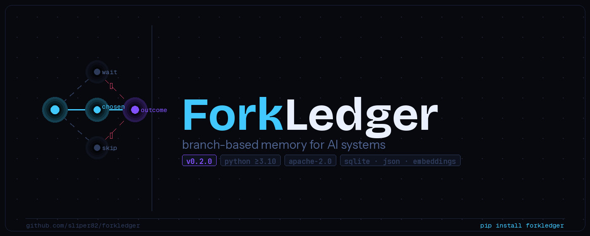

<p align="center">
  
</p>

<p align="center">
  <a href="https://github.com/sliper82/forkledger/actions"></a>
  <a href="https://pypi.org/project/forkledger/"></a>
  <a href="https://pypi.org/project/forkledger/"></a>
  <a href="LICENSE"></a>
  <a href="https://github.com/sliper82/forkledger/blob/main/COMPARISON.md"></a>
</p>

<p align="center">
  <b>The memory layer your AI agents actually need.</b><br/>
  Not what was said — but what was chosen, what it cost, and what to do differently next time.
</p>

---

## The problem with AI memory today

Every major memory system stores **what happened**: messages, chunks, embeddings, facts.

None of them store **why a decision was made** — or what it cost.

That means every time your agent faces the same situation, it starts from zero. It can't learn from its own mistakes. It has no way to say: *"Last time I chose this, it cost me 3 points. Don't do it again."*

**ForkLedger fixes this.**

---

## What ForkLedger stores

```
situation before the choice
        ↓
[ branch A ] [ branch B ✓ chosen ] [ branch C ]
                     ↓
               observed outcome
                     ↓
     regret vector — what each path cost relative to the best
```

Over time, ForkLedger learns which branches produce the lowest regret under similar conditions — and surfaces that knowledge when it matters.

---

## Install

```bash
pip install forkledger              # core — zero dependencies
pip install forkledger[mcp]         # + MCP server (Claude Desktop, Cursor, VS Code)
pip install forkledger[api]         # + REST API (FastAPI)
pip install forkledger[embeddings]  # + semantic similarity
pip install forkledger[all]         # everything
```

---

## 60-second demo

```python
from forkledger import ForkLedgerEngine, ForkRecord, Branch, OutcomeEstimate

engine = ForkLedgerEngine("decisions.db", backend="sqlite")

# Record a decision and its outcome
engine.add_record(ForkRecord(
    fork_id   = "trade-001",
    pre_state = {"market": "BTC", "signal": "breakout", "volume": "high"},
    trigger   = "RSI crossed 70 with volume confirmation",
    possible_branches = [Branch("enter"), Branch("wait"), Branch("short")],
    chosen_branch     = "enter",
    realized_value    = 2.4,
    estimated_outcomes = [
        OutcomeEstimate("wait",  estimated_value=0.0),
        OutcomeEstimate("short", estimated_value=-1.5),
    ],
    confidence = 0.8,
    tags = ["crypto", "momentum"],
))

# Update with actual result after the fact
engine.update_outcome("trade-001", realized_value=1.9)

# Ask: given this new situation, what should I do?
recs = engine.recommend(
    current_state = {"market": "ETH", "signal": "breakout", "volume": "high"},
)
# → [{"branch": "enter", "score": 0.82}, ...]

# What patterns have emerged from repeated decisions?
policies = engine.policies()
# → [{"recommended_branch": "enter", "win_rate": {"enter": 0.72}, ...}]

# Win rates across all historical decisions
win_rates = engine.win_rates()

# CFR-style accumulated regret (time-decay weighted)
regret = engine.accumulated_regret()

# Full audit trail with effective weights
trail = engine.audit_trail()
```

---

## MCP Server — works with Claude Desktop, Cursor, VS Code

```bash
pip install forkledger[mcp]
```

Add to your Claude Desktop config (`~/.config/claude/claude_desktop_config.json`):

```json
{
  "mcpServers": {
    "forkledger": {
      "command": "forkledger",
      "args": ["mcp", "--store", "/path/to/decisions.db", "--backend", "sqlite"]
    }
  }
}
```

Your Claude agent can now:
- `record_decision(...)` — store a decision with alternatives and outcome
- `get_recommendation(...)` — ask what worked in similar past situations
- `update_outcome(...)` — update realized value after observing results
- `get_policies(...)` — see distilled patterns from repeated decisions
- `list_decisions(...)` — browse decision history
- `memory_stats()` — store health and statistics

**No code required. Works with any MCP-compatible client.**

---

## REST API

```bash
pip install forkledger[api]
forkledger serve --backend sqlite --store decisions.db
# → http://localhost:8000/docs  (Swagger UI)
```

| Method | Path | Description |
|--------|------|-------------|
| `GET` | `/health` | Health check |
| `GET` | `/stats` | Store statistics |
| `GET` | `/forks` | List (filterable by tags, confidence) |
| `POST` | `/forks` | Add one fork |
| `POST` | `/forks/bulk` | Bulk add |
| `PATCH` | `/forks/{id}/outcome` | Update realized value |
| `DELETE` | `/forks/{id}` | Delete |
| `DELETE` | `/forks/expired` | Purge expired |
| `POST` | `/recommend` | Get branch recommendations |
| `POST` | `/rank` | Rank forks by similarity |
| `GET` | `/policies` | Distilled policies |
| `GET` | `/win-rates` | Win rates per branch |
| `GET` | `/audit` | Decision audit trail |
| `GET` | `/export` | Export all as JSON |

---

## Docker

```bash
docker run -p 8000:8000 -v $(pwd)/data:/data \
  ghcr.io/sliper82/forkledger:latest

# or with compose:
docker compose up
```

---

## Dashboard

```bash
pip install forkledger[dashboard]
forkledger dashboard --store decisions.db --backend sqlite
# → http://localhost:8501
```

Visualize decision history, win rates, accumulated regret, and policies.

---

## CLI

```bash
forkledger add decisions.json                           # load from file
forkledger recommend --state '{"signal":"breakout"}'   # get recommendation
forkledger update-outcome trade-001 1.9                 # update outcome
forkledger policies --min-support 3                     # distilled patterns
forkledger win-rates                                    # branch win rates
forkledger accumulated-regret                           # CFR-weighted regret
forkledger audit --limit 20                             # decision trail
forkledger stats                                        # store health
forkledger serve --backend sqlite --port 8000           # REST API
forkledger mcp --backend sqlite                         # MCP server
```

---

## What's unique about ForkLedger

| Concept | Description |
|---------|-------------|
| **Regret vector** | Computed automatically. `regret(branch) = best_value − branch_value`. Zero = best choice. |
| **Fuzzy policy clustering** | Groups similar (not just identical) states. Real-world agent states are never perfectly equal. |
| **Confidence decay** | Exponential time-weighting. Old evidence fades. Configurable half-life. |
| **CFR-style accumulation** | Weighted regret accumulates across history per branch, similar to Counterfactual Regret Minimization. |
| **Branch win rates** | How often each branch was the best available choice. |
| **Outcome update** | Update realized values after observing results. Regret is recomputed automatically. |
| **Zero dependencies** | Core library requires nothing. SQLite is stdlib. All extras are opt-in. |

---

## How it compares

→ See [COMPARISON.md](COMPARISON.md) for a full side-by-side with Mem0, Hindsight, LangMem, and mcp-memory.

**Short version:** ForkLedger does not compete with those systems — it complements them. They store facts. ForkLedger stores decisions.

---

## Architecture

```
ForkLedgerEngine
├── storage/
│   ├── JsonForkStore       — flat file, zero deps
│   ├── SqliteForkStore     — indexed, atomic, production
│   └── PostgresForkStore   — cloud-native, pgvector
├── counterfactual.py       — regret + decay + CFR accumulation
├── retrieval.py            — scoring + optional embeddings
├── policy.py               — fuzzy + exact policy distillation
├── mcp_server.py           — MCP server (8 tools)
├── api.py                  — FastAPI REST (14 endpoints)
├── cli.py                  — CLI (18 commands)
└── dashboard/app.py        — Streamlit UI
```

**Retrieval scoring:**

| Signal | Weight |
|--------|--------|
| State similarity | 45% |
| Constraint match | 20% |
| Recency | 15% |
| Confidence | 10% |
| Regret salience | 10% |

---

## Benchmark results

```
ForkLedger Benchmark — 300 records, 80 queries
Load: 2.19s (137 rec/s)
Latency: p50=5.6ms  p95=25.9ms
Precision@1: 100.0%
Policy accuracy: 4/4 = 100.0%
```

Run yourself:
```bash
python benchmarks/locomo_benchmark.py --records 500 --queries 100
```

---

## Roadmap

- [x] SQLite + JSON backends
- [x] REST API (FastAPI)
- [x] MCP server (Claude Desktop, Cursor, VS Code)
- [x] Fuzzy policy clustering
- [x] Confidence decay + CFR-style accumulation
- [x] Branch win rates + audit trail
- [x] PostgreSQL + pgvector backend
- [x] Streamlit dashboard
- [x] Benchmark suite
- [ ] LangChain official memory adapter
- [ ] AutoGen integration
- [ ] PyPI release

---

## Contributing

```bash
git clone https://github.com/sliper82/forkledger
cd forkledger
pip install -e ".[dev]"
pytest
python benchmarks/locomo_benchmark.py
```

Issues, PRs, and ideas welcome. See [CONTRIBUTING.md](CONTRIBUTING.md).

---

## License

[Apache 2.0](LICENSE)
